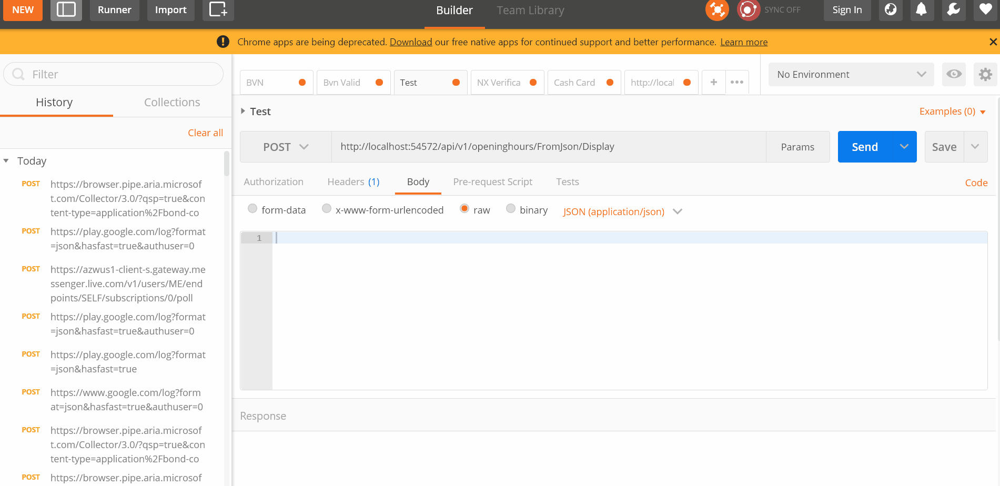

# Opening Hours In ASP.Net Core 
A Web API built with C# that accepts JSON-formatted opening hours of a restaurant as an input, either as a string or JSON object, and outputs hours in more human readable format



## Content
* [Features](https://github.com/ebendcelebrant/Opening_Hours/tree/master#features)
* [How To Run](https://github.com/ebendcelebrant/Opening_Hours/tree/master#how-to-run)
* [Thoughts On The Data Format](https://github.com/ebendcelebrant/Opening_Hours/tree/master#thoughts-on-the-data-format)

## Features
The project was developed using Web API 2.0 on Asp.Net with C# as the language. It has two main endpoints:<br />
<ol>
<li><b>FromJson/Display</b> : Displays the opening hours in a human readable format when the JSON-Formatted input is provided as a JSON object.</li>
<li><b>FromString/Display</b> : Displays the opening hours in a human readable format when the JSON-Formatted input is provided as a string.</li>
</ol>
The project follows a very basic domain driven design with a level of abstraction where the structure of the design is unaware 
of the actual implementation of the code. It also implements basic exception logging in the event that an erroneous input is provided to it. Swagger has also been 
implemented to provide some basic level of description of the endpoints

## How To Run
#### Requirements
Visual Studio was used in this project and the solution file is in VS format. <br />
#### Steps
<ol>
<li>Clone the repository and go to the root folder <i>Opening_Hours-Master</i></li>
<li>Double Click on the solution file called OpeningHoursInterviewQuestion.sln</li>
<li>The VS project should be open on your computer. You can then click the run button to access the web app</li>
<li>Click on <b>blue</b> <i>Learn More</i> button to open up swagger api documentation to view the endpoints in a user friendly version</li>
<li>Test and Enjoy!!</li>
</ol>

## Thoughts On The Data Format
The second part of the question has to do with my thoughts on the data format. Firstly, I believe this exercise, in it's entirety, provided a good opportunity to examine 
good software development practices, problem solving and critical thinking. However, a little more information and background may be needed to properly evaluate my thoughts on the format. Based on the information available, I believe there is a format in which the data could have been formatted that will ease the different stakeholders of the project. I call this format the <i>Programmer-Centric Approach</i>

### The Programmer-Centric Approach
This is basically the data formatting style that will benefit the programmer and the non-IT user the most. It is already almost readable and doesn't require much coding.
It also handles the closing time of each day within the day itself i.e. if it closes the next day, the closing time is still kept within the day it opened. It can also 
have an extra key to give some more information on the entry, called <i>next_day</i> which will be a boolean<br />
Here's a sample
```
{
  "sunday": [
    {
      "opening_time": "8 AM",
      "closing_time": "10:30 PM",
      "next_day": "false"
    }
  ],
  "monday": [
    {
      "opening_time": "10 AM",
      "closing_time": "1:30 PM",
      "next_day": "false"
    },
    {
      "opening_time": "4 pM",
      "closing_time": "1:30 AM",
      "next_day": "true"
    }
  ],
}
```


